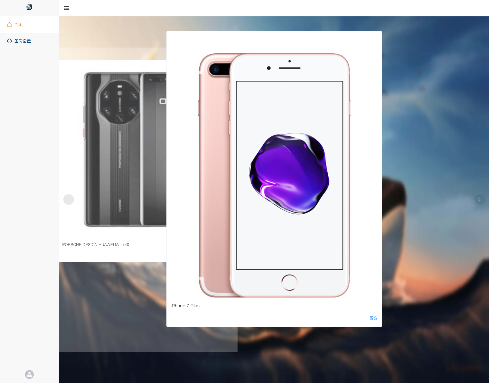

<p align="center">
  <a href="https://orcastor.github.io/doc/">
    
  </a>
</p>

<h1 align="center"><strong>OrcaS 手机备份插件</strong><sup><a href="https://jb.gg/OpenSourceSupport"> via </a></sup></h1>

<p align="center">
  <a href="https://raw.githubusercontent.com/orcastor/addon-backup/master/assets/demo.png">
    
  </a>
</p>

## 目标

- 💣 性能提升
  - 🚀 支持超快速备份
    - 方案一：利用fuse，先写入本地内存文件系统
    - 方案二：直接对接协议层
    - 优化点：
      - 🗃 小文件打包
        - 大量小文件会导致写入性能下降（即使SSD盘也只有110 MB/s左右）
      - 🏎 智能调速
        - iPhone备份一阵发送数据，一阵收集数据，收发如果不同步耗时会成倍增加，优化为感知发端收集数据，收端写数据
      - ~~忽略不影响使用的文件（常见软件的缓存、安装包等）~~
      - 考虑用白名单机制，只保存需要的数据（图片/视频/微信等）
- 🛎 备份体验和交互优化
  - 断点续备
  - WIFI备份
  - 自动备份

## 性能测试

### iOS备份

- 手机：iPhone 6s Plus **40.5 GB**
- 磁盘：500 GB黑盘，写入速度上限150 MB/s

|测试项|耗时|备份大小|平均速度|
|-|-|-|-|
|原版iTunes|20分钟|14.4 GB|12 MB/s|
|fuse内存文件系统|TBD|TBD|
|直接对接协议层|10分钟（只接收数据不写磁盘）|TBD|

### iOS恢复

- 手机：iPhone 7 Plus **备份大小40.83 GB**
- 磁盘：1TB 希捷酷鱼，读取速度上限170 MB/s

|测试项|耗时|数据大小|平均速度|
|-|-|-|-|
|原版iTunes|2小时24分钟|16.97 GB|1.96 MB/s|
|fuse内存文件系统|TBD|TBD|
|直接对接协议层|TBD|TBD|

## 实现细节

#### iOS

- 使用[`idevicebackup2`](https://github.com/libimobiledevice/libimobiledevice)像iTunes一样备份
- 使用[`gidevice`](https://github.com/orcastor/gidevice)直接对接协议层
- **注意：有issue中提到协议版本不是最新的风险**
  - 例如使用备份工具异常退出后，再次发起备份，`iTunes`可能会通过特殊协议解除这个状态，
  - 通过`libimobiledevice`无法绕过，只能重启设备后恢复正常，需要通过抓包分析`iTunes`的行为跟踪

#### Android

- 使用`adb` + [`better-adb-sync`](https://github.com/jb2170/better-adb-sync)
- 使用`smb`协议（由[addon_disk](https://github.com/orcastor/addon-disk)项目赋能）
  - [自动备份华为手机系统及文件到NAS](https://www.oureiq.top:8812/2023/02/09/%E8%87%AA%E5%8A%A8%E5%A4%87%E4%BB%BD%E5%8D%8E%E4%B8%BA%E6%89%8B%E6%9C%BA%E7%B3%BB%E7%BB%9F%E5%8F%8A%E6%96%87%E4%BB%B6%E5%88%B0nas/)
  - [手把手教你把华为手机完整备份到NAS](https://www.cnblogs.com/djd66/p/16635579.html)
- 使用[`gadb`](https://github.com/electricbubble/gadb)直接对接协议层

### 监听USB设备热插拔事件

> 需要先安装[libusb](https://github.com/gotmc/libusb)的C库

#### OS X

```bash
$ brew install libusb
```

#### Windows

从[libusb.info](https://libusb.info)下载最新的二进制文件

#### Linux

```bash
$ sudo apt-get install -y libusb-dev libusb-1.0-0-dev
```

## 界面设计

- 是否自动备份开关
- 备份首页默认展示设备管理
  - 默认隐藏未连接设备
  - 按最近备份时间排序
- 展示手机屏幕截图

### 注意事项 

- `yarn run build:pro`打包后的文件和webapp的放置到一起：

  > `ln -s $(addon-backup)/front/dist/ $(webapp)/dist/bak`
